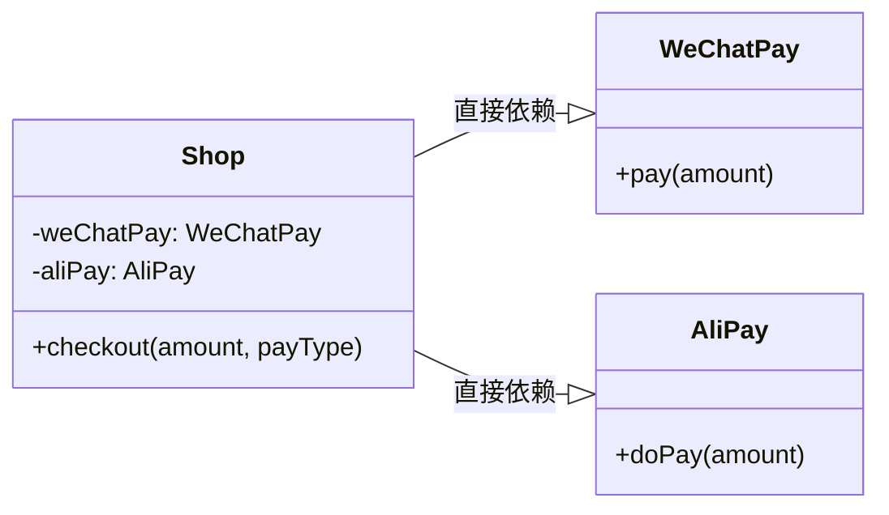
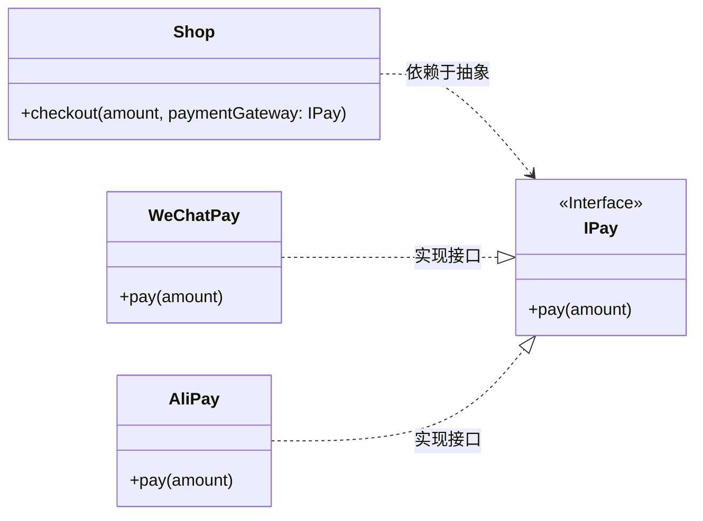

> [!INFO] 引言
> 从了解设计模式开始引入到文章，从了解某个设计模式开始记录标题，到后来设计模式的具体使用记录每次设计模式的使用以及思考

## 设计原则

### 单一职责原则

### 依赖倒置原则

*定义：* 高层模块不能直接依赖底层模块，二者都应该依赖于抽象。抽象不依赖细节，细节依赖抽象。

*原始设计：*

*使用依赖倒置重构：*

## 单例模式

...
## 组合模式

...
## 状态模式

...
## 工厂模式

...

## 注册表模式

...